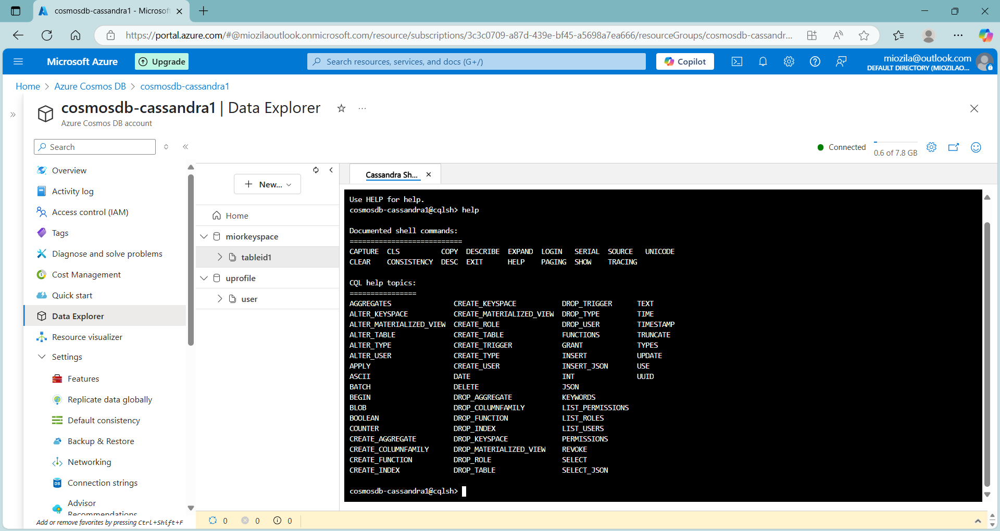
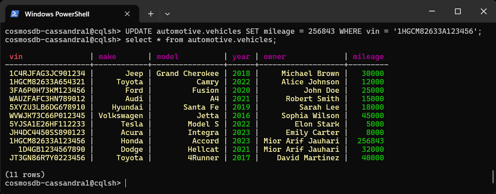
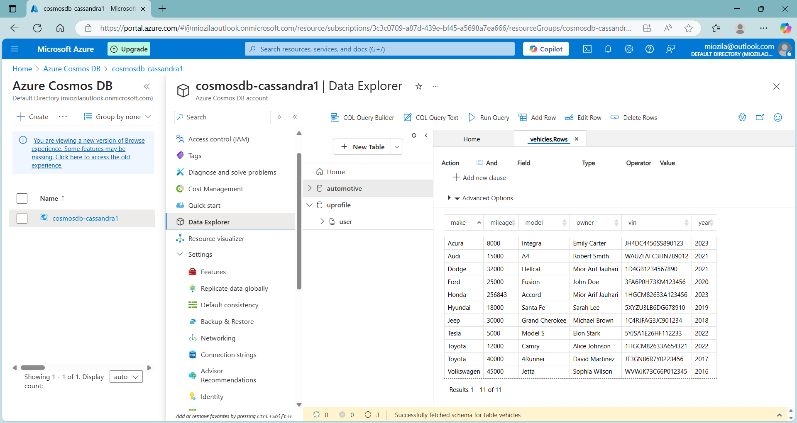
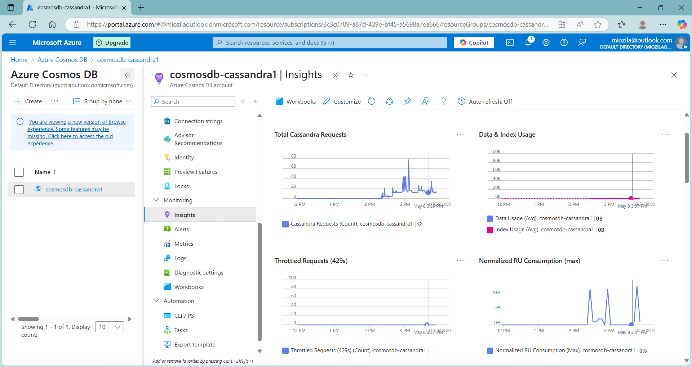
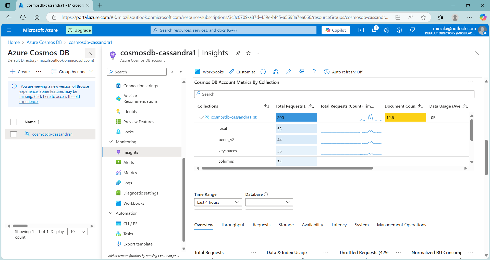

# cosmosdbcassandra 🪐
cosmosdbcassandra : # cosmosdb # cassandra # nosql database

## Objectives
- To handle massive volumes of unstructured or semi-structured data with high scalability, flexibility & speed — especially for modern applications like big data analytics, IoT & real-time web services
- Cosmos DB Similar Services/Technology : Google Bigtable, Amazon DynamoDB, Apache Cassandra, MongoDB, Redis, Neo4j, Apache HBase  

## Cassandra for Cosmos DB

